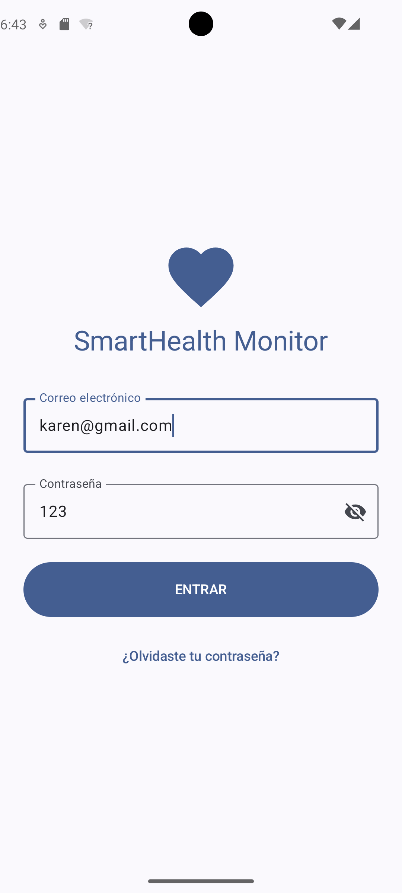
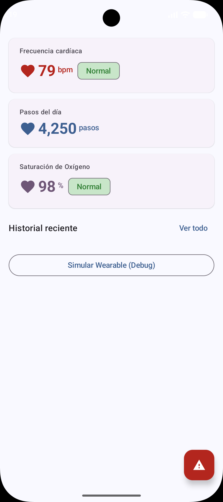

# SmartHealth Monitor

Aplicación Android multiplataforma para monitoreo de salud personal.
Desarrollada como proyecto integrador en UTNG — 9° Cuatrimestre 2025.

## Stack tecnológico
- Kotlin + Jetpack Compose
- Material Design 3
- Wearable Data Layer API (Wear OS)
- Android TV / Leanback + Media3
- Jetpack Navigation + Room + StateFlow

## Pantallas implementadas
- [x] LoginScreen — S4
- [x] DashboardScreen — S5
- [ ] Historial + wearable real — S6
- [ ] Android TV — S10-S12

## Autor
Karen Anahi Padron Martinez — UTNG — karen.padron@utng.edu.mx

## Capturas de pantalla

### Login

*Pantalla de inicio de sesión con validación de email y contraseña*

### Dashboard

*Dashboard principal con FC, pasos e historial reciente*

## Stack tecnológico
- Kotlin + Jetpack Compose
- Material Design 3
- Wearable Data Layer API (Wear OS)
- Android TV / Leanback + Media3
- Jetpack Navigation + Room + StateFlow

## ¿Qué hace este PR?
Integra Health Services API para lectura real del sensor FC del wearable.
Agrega Room DB para persistir el historial de lecturas.
Conecta HistorialScreen con Room vía StateFlow reactivo.
 
## Archivos creados/modificados
- [x] wear/.../HealthDataService.kt — PassiveMonitoringClient
- [x] data/db/LecturaFC.kt — @Entity Room
- [x] data/db/LecturaFCDao.kt — @Dao con Flow
- [x] data/db/SmartHealthDB.kt — @Database singleton
- [x] data/SmartHealthRepository.kt — actualizado con Room
- [x] ui/viewmodel/DashboardViewModel.kt — historial desde Room
- [x] ui/screens/HistorialScreen.kt — completo con estado vacío
- [x] navigation/NavGraph.kt — HistorialScreen real
 
## Cómo probar
1. Emulador Wear OS → Extended Controls → Health Services → mover slider FC.
2. Verificar que Dashboard muestra el valor del slider en tiempo real.
3. Abrir Historial: lecturas deben aparecer en orden descendente.
4. FC > 100 debe aparecer en rojo.
5. Cerrar y reabrir la app: historial debe persistir.
 

