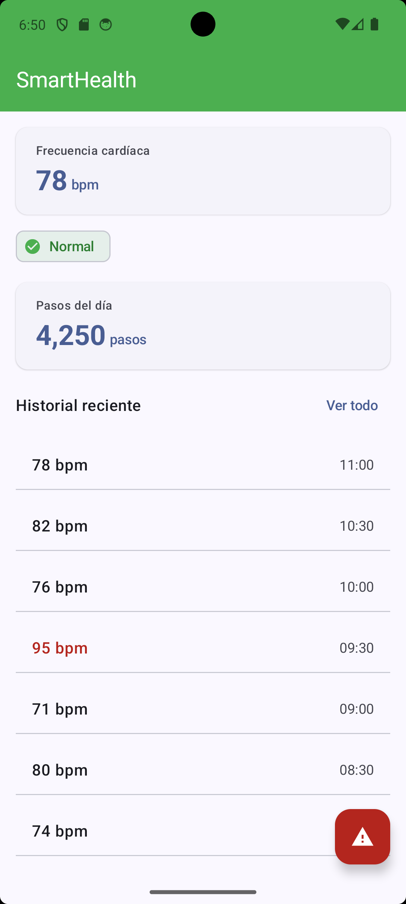
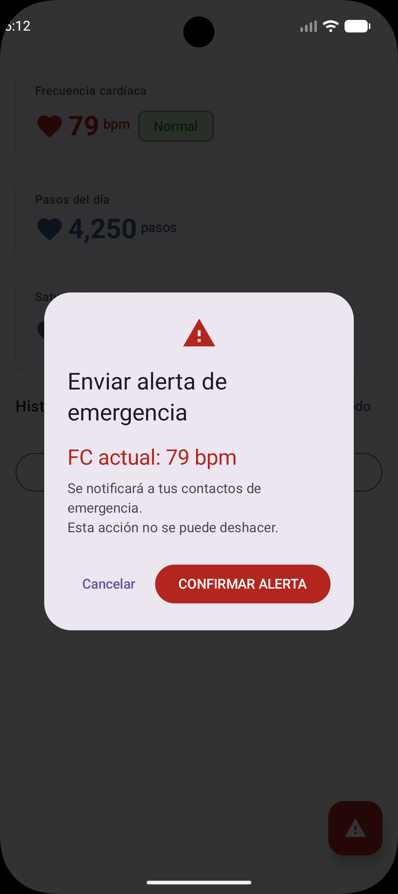
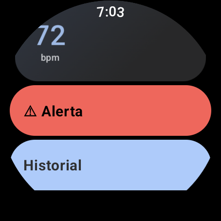
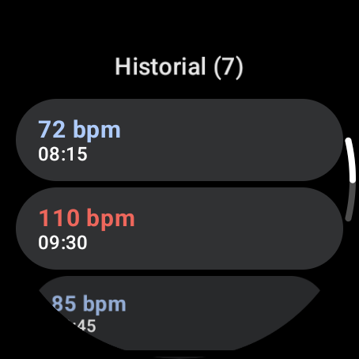

# SmartHealth Monitor


Aplicación Android de monitoreo de salud personal en tiempo real.
Desarrollada como proyecto integrador — UTNG 9° Cuatrimestre 2025.

## Stack tecnológico

| Tecnología | Uso |
|---|---|
| Kotlin + Jetpack Compose | UI declarativa con Material Design 3 |
| Wearable Data Layer API  | Comunicación reloj ↔ teléfono (BLE) |
| Health Services API     | Sensor FC real en background (Wear OS) |
| Room Database           | Historial persistente de lecturas FC |
| Jetpack Navigation      | NavHost entre 4 pantallas |
| GitHub + Conventional Commits | Control de versiones profesional |

## Pantallas

| Pantalla | Descripción |
|---|---|
| LoginScreen | Autenticación con validación y State |
| DashboardScreen | FC y Pasos en tiempo real del wearable |
| HistorialScreen | Lecturas persistidas en Room con Flow reactivo |
| AlertaScreen | AlertDialog MD3 + Snackbar de confirmación |

## Capturas de pantalla





## Unidad II — Wear OS

| Pantalla | Descripción |
|---|---|
| WearDashboardScreen | FC en tiempo real con ScalingLazyColumn y TimeText |
| WearHistorialScreen | Lista con Rotary Input (corona del reloj) |
| WearAlertaScreen | Botones circulares de confirmación |
| SmartHealth WatchFace | Hora + FC en el WatchFace nativo |





## Arquitectura — SmartHealth Monitor
 
```
Sensor PPG (Wear OS)
    │  Health Services API
    ▼
PassiveListenerService (wear)
    │  MessageClient (BLE)
    ▼
WearListenerService (app)
    │  SmartHealthRepository
    ▼
StateFlow<Int> (fcActual)  ──────────────────────────────────┐
    │                                                        │
    ▼                                                        ▼
DashboardViewModel (app)              TvViewModel (tv)
    │  collectAsState()                    │  collectAsState()
    ▼                                        ▼
DashboardScreen (Compose)          TvCatalogScreen (Compose TV)
    └── CastButton ──► Chromecast (Remote Playback)
 
Room DB (LecturaFC)  ◄──  Repository  ──►  Flow<List<LecturaFC>>
                                                │
                          ┌─────────────────────┴──────────┐
                          ▼                                ▼
               HistorialScreen (app)        TvCatalogScreen (tv)
```

## Autor
Karen Anahi Padron Martinez — UTNG — Ing. en Desarrollo y Gestión de Software

